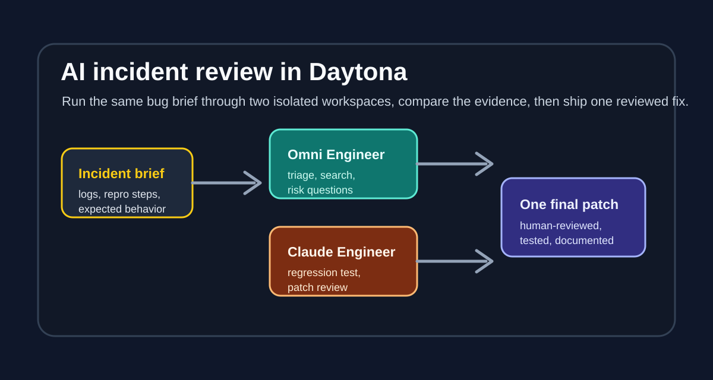

# Run AI Incident Reviews in Daytona

## Introduction

AI engineering tools are most useful when their work is reproducible. If an agent investigates a bug from a laptop full of hidden state, it can be hard to know whether the result came from the codebase, the prompt, the local machine, or a half-forgotten environment variable.

Daytona gives each investigation a clean workspace, so the commands, dependencies, and credentials are easier to reason about.

In this tutorial, you will run Omni Engineer and Claude Engineer as two separate AI engineering workspaces in Daytona. Omni Engineer is useful for broad triage, file review, and model-flexible research through OpenRouter.

Claude Engineer is useful for structured patch planning, regression-test thinking, and a web or CLI interface backed by Anthropic.

Running both in separate [Dev Containers](/definitions/20240910_definition_dev_container_feature.md) gives you two independent views of the same incident before you decide what to merge.



## TL;DR

- Add a `.devcontainer/devcontainer.json` file to each AI engineer repository.
- Store `OPENROUTER_API_KEY` and `ANTHROPIC_API_KEY` as Daytona environment variables instead of committing secrets.
- Open Omni Engineer and Claude Engineer in separate Daytona workspaces.
- Give both tools the same incident brief, then compare their evidence before shipping one final patch.

## What You Will Build

The workflow in this article uses a small but realistic incident-review loop:

1. A production endpoint sometimes returns success while hiding an error in the response body.
2. Omni Engineer reviews the bug report, searches the codebase, and writes a triage brief.
3. Claude Engineer reviews the same brief, proposes a regression test, and drafts a patch plan.
4. You compare both outputs and apply one reviewed fix in your application repository.

The point is not to let two agents race each other. The point is to make their reasoning auditable. Daytona keeps each AI engineer in a predictable workspace so you can reproduce setup, inspect changes, and discard experiments without contaminating your main machine.

## Prerequisites

Before starting, make sure you have:

- A working Daytona installation.
- Docker or another Daytona-compatible target configured.
- An OpenRouter API key for Omni Engineer.
- An Anthropic API key for Claude Engineer.
- GitHub access to your application repository and to your forks of the AI engineer repositories.

The companion Dev Container pull requests for this tutorial are:

- Omni Engineer Dev Container: [Doriandarko/omni-engineer#36](https://github.com/Doriandarko/omni-engineer/pull/36)
- Claude Engineer Dev Container: [Doriandarko/claude-engineer#260](https://github.com/Doriandarko/claude-engineer/pull/260)

## Add the Omni Engineer Dev Container

In your Omni Engineer fork, create `.devcontainer/devcontainer.json`:

```json
{
  "name": "Omni Engineer",
  "image": "mcr.microsoft.com/devcontainers/python:1-3.11-bullseye",
  "postCreateCommand": "python -m pip install --upgrade pip && pip install -r requirements.txt",
  "remoteEnv": {
    "OPENROUTER_API_KEY": "${localEnv:OPENROUTER_API_KEY}"
  },
  "customizations": {
    "vscode": {
      "extensions": [
        "ms-python.python",
        "ms-python.vscode-pylance"
      ]
    }
  }
}
```

This keeps the setup intentionally small. The container installs Python dependencies from `requirements.txt`, passes `OPENROUTER_API_KEY` from the workspace environment, and avoids writing credentials into the repository.

Commit the file and open a pull request against `Doriandarko/omni-engineer`.

## Add the Claude Engineer Dev Container

In your Claude Engineer fork, create `.devcontainer/devcontainer.json`:

```json
{
  "name": "Claude Engineer",
  "image": "mcr.microsoft.com/devcontainers/python:1-3.11-bullseye",
  "postCreateCommand": "python -m pip install --upgrade pip && pip install -r requirements.txt && cp -n .env.example .env",
  "forwardPorts": [
    5000
  ],
  "remoteEnv": {
    "ANTHROPIC_API_KEY": "${localEnv:ANTHROPIC_API_KEY}"
  },
  "customizations": {
    "vscode": {
      "extensions": [
        "ms-python.python",
        "ms-python.vscode-pylance"
      ]
    }
  }
}
```

Claude Engineer includes a Flask web interface, so the Dev Container forwards port `5000`. The setup also copies `.env.example` to `.env` when the file does not exist yet, which gives contributors a local configuration file without overwriting existing values.

Commit the file and open a pull request against `Doriandarko/claude-engineer`.

## Store Secrets in Daytona

Add your API keys to Daytona before creating the workspaces:

```bash
daytona env set OPENROUTER_API_KEY=your-openrouter-key
daytona env set ANTHROPIC_API_KEY=your-anthropic-key
```

Confirm that Daytona knows about the variables:

```bash
daytona env list
```

Do not paste these keys into issues, pull requests, screenshots, or article assets. The Dev Container files read the keys from the workspace environment.

## Create the Two Workspaces

Create one workspace for Omni Engineer and another for Claude Engineer. If the Dev Container pull requests have already been merged, create the workspaces from the upstream repositories:

```bash
daytona create https://github.com/Doriandarko/omni-engineer
daytona create https://github.com/Doriandarko/claude-engineer
```

If the pull requests are still under review, create the workspaces from your fork branches that contain the Dev Container files. The important rule is that each workspace should build from a branch where `.devcontainer/devcontainer.json` is present.

After each workspace opens, verify the dependency install:

```bash
python --version
python -m pip show rich
```

For Omni Engineer, start the console:

```bash
python main.py
```

For Claude Engineer, start either the web interface or the CLI:

```bash
python app.py
```

```bash
python ce3.py
```

When using the web interface, open the forwarded Daytona URL for port `5000`.

## Prepare the Incident Brief

Create a short incident brief that both AI engineer workspaces will receive. Keep it factual and compact:

```markdown
# Incident Brief

## Symptom
The customer update endpoint sometimes returns HTTP 200 even when the server action reports an internal error in the JSON body.

## Expected behavior
The UI should show an error toast and avoid claiming the update succeeded.

## Evidence
- Reproduction path: edit a customer record with a forced server-side validation failure.
- Suspected pattern: frontend only checks for transport errors, not `serverError` in the response body.
- Desired output: locate affected call sites, propose a regression test, and patch only the smallest safe surface.

## Stop rules
- Do not refactor unrelated request helpers.
- Do not change API response contracts without noting compatibility risk.
- Do not commit secrets or production data.
```

Save the brief as `incident-brief.md` in both workspaces, or paste the same text into each tool.

## Run Omni Engineer for Triage

Use Omni Engineer first for broad investigation. A good initial prompt is:

```text
Read incident-brief.md. Inspect the repository for places where server action results are treated as successful without checking `serverError`. Return a triage brief with likely files, risky assumptions, and the smallest patch surface. Do not edit files yet.
```

Ask it to show evidence before proposing a fix:

```text
For each suspected file, quote the condition that currently marks the action successful and explain why it can miss `serverError`.
```

The useful output from this workspace is a triage note, not a patch. Save the final answer as `omni-triage.md`.

## Run Claude Engineer for a Patch Plan

Use Claude Engineer second for a more test-oriented review. A good initial prompt is:

```text
Read incident-brief.md and omni-triage.md. Propose the smallest regression test and patch plan. Separate confirmed facts from assumptions. Do not edit files until the test target is clear.
```

Then ask for the final implementation plan:

```text
Write the exact patch plan in three parts: regression coverage, code change, and verification commands. Flag any place where the UI behavior is ambiguous.
```

The useful output from this workspace is a patch plan you can review before touching the application. Save it as `claude-patch-plan.md`.

## Compare Before You Patch

Before changing the application, compare both outputs:

- Did both tools identify the same success condition?
- Did either tool find an extra call site?
- Did either tool assume a response shape that is not present in the code?
- Is the proposed test focused on behavior instead of implementation details?

Only then make the patch in your application workspace. If the tools disagree, treat the disagreement as a review signal. Re-open the code, verify the response type, and update the incident brief before asking either tool for more work.

## Verification Checklist

Use this checklist before you open the final application pull request:

- The bug is reproduced or described with enough detail for a reviewer.
- The patch changes only the affected success/error handling path.
- A regression test or manual verification note covers the false-success case.
- Both AI engineer workspaces can be deleted and recreated from Dev Container configuration.
- The final pull request includes human-written verification notes, not just agent output.

## Cleanup

When the incident review is complete, delete any temporary workspaces you no longer need:

```bash
daytona delete
```

Keep the Dev Container pull requests open. They make the workflow reusable for future incidents and let other contributors reproduce the setup without guessing which Python version or dependency command to use.

## Conclusion

Running Omni Engineer and Claude Engineer inside Daytona gives you a repeatable way to compare AI-assisted debugging without mixing tool state, dependencies, or credentials.

Omni Engineer can produce a broad triage view, Claude Engineer can pressure-test the patch plan, and you still make the final engineering decision.

This pattern works best when the prompt includes stop rules, the workspaces stay isolated, and the final patch is reviewed as normal code. The AI tools help you look twice. Daytona makes those two looks reproducible.

## References

- [Daytona documentation](https://www.daytona.io/docs/)
- [Dev Containers specification](https://containers.dev/)
- [Omni Engineer](https://github.com/Doriandarko/omni-engineer)
- [Claude Engineer](https://github.com/Doriandarko/claude-engineer)
