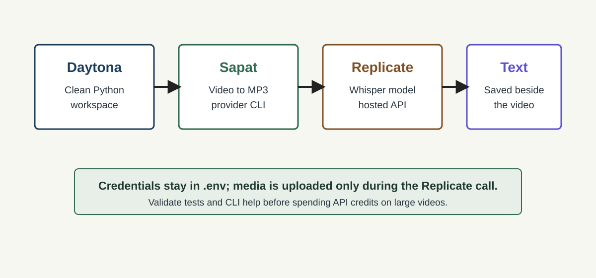

# Run Replicate Whisper With Sapat in Daytona

## Introduction

Sapat is a small Python command-line tool for turning video files into text
transcripts. It already handles the practical parts of the workflow: converting
video to MP3 with FFmpeg, sending the audio to a transcription provider, and
writing a `.txt` file next to the original media. That makes it a good base for
trying more speech-to-text providers without redesigning the whole pipeline.

This guide shows how to run Sapat with a Replicate-hosted Whisper model inside a
Daytona workspace. The workflow is useful when you want a reproducible Python
sandbox for testing provider integrations, comparing transcription backends, or
building a repeatable media-processing environment without installing every
system dependency on your laptop.

The companion Sapat implementation for this guide is under review in
[nibzard/sapat#32][sapat-pr]. Until that change lands upstream, the commands
below use the provider branch from the contributor fork so the guide remains
reproducible.

## TL;DR

- Use Daytona to open a clean Python workspace for the Sapat project.
- Install Sapat in editable mode and keep FFmpeg inside the dev environment.
- Configure `REPLICATE_API_TOKEN` in `.env`; do not commit it.
- Run `sapat <video>.mp4 --api replicate` to produce a transcript.
- Use the unit tests and CLI help output as a quick check before spending API
  credits on a real transcription.

## What You Will Build

The final workflow has four moving parts:



Daytona gives you the disposable development environment. Sapat owns the local
media-processing pipeline. The Replicate Python client handles the upload of the
converted audio file. The Replicate `openai/whisper` model returns text output
that Sapat saves as a transcript.

That separation matters. You can swap the transcription provider without
changing how you create Daytona workspaces, and you can test Daytona workspace
changes without touching your Replicate account.

## Prerequisites

Before starting, you need:

- A GitHub account that can clone or fork repositories.
- Daytona CLI installed. The Daytona docs show the current install command and
  CLI entry point in the [getting started guide][daytona-getting-started].
- Docker or another Daytona-compatible target available on your machine.
- A Replicate account with an API token from the Replicate account settings.
- A short `.mp4`, `.mov`, or other video file you are allowed to upload to a
  third-party transcription service.

This guide also uses a [speech-to-text API][speech-to-text-definition]. In this
case, the API is Replicate running a hosted Whisper model.

## Step 1: Open the Sapat Project in Daytona

Start by creating or opening a Daytona sandbox for the Sapat provider branch.
If the Replicate provider has already merged upstream, use the upstream Sapat
repository. Until then, clone the fork branch that contains the implementation:

```bash
git clone https://github.com/autonomousventurelab-jpg/sapat.git
cd sapat
git switch avl/replicate-transcription-provider
```

If you prefer the Daytona CLI flow, create a sandbox from the Git repository and
then open its terminal in your IDE:

```bash
daytona create
```

Choose the Sapat repository when Daytona asks for the source. The exact prompts
can vary by Daytona version and target, but the result should be a terminal
inside a sandbox with the Sapat repository checked out.

## Step 2: Add a Python Dev Container Shape

If your sandbox does not already have Python and FFmpeg available, add a simple
dev container configuration to the project. Create
`.devcontainer/devcontainer.json` with this content:

```json
{
  "name": "Sapat Replicate Transcription",
  "image": "mcr.microsoft.com/devcontainers/python:3.12-bookworm",
  "features": {
    "ghcr.io/devcontainers/features/common-utils:2": {}
  },
  "postCreateCommand": "python -m pip install -e .",
  "customizations": {
    "vscode": {
      "extensions": [
        "ms-python.python",
        "charliermarsh.ruff"
      ]
    }
  }
}
```

FFmpeg is required because Sapat converts video files to MP3 before sending the
audio to a transcription backend. Install it inside the workspace before the
first transcription run:

```bash
sudo apt-get update
sudo apt-get install -y ffmpeg
```

Installing Sapat with `pip install -e .` keeps the package editable, so
provider changes are available immediately while you are testing.

After adding the file, rebuild or recreate the Daytona workspace if your IDE
does not automatically pick up the dev container configuration.

## Step 3: Configure Replicate Credentials

Create a local `.env` file in the Sapat project root. Do not commit this file.
It should contain your Replicate token and the provider settings you want to
use:

```env
REPLICATE_API_TOKEN=r8_your_token_here
REPLICATE_MODEL=openai/whisper
REPLICATE_TRANSLATE=false
REPLICATE_MAX_FILE_SIZE_MB=100
```

The default `REPLICATE_MODEL` points to Replicate's hosted `openai/whisper`
model. Replicate documents that the model accepts an `audio` input, an optional
Whisper model size, and a `translate` flag, then returns transcription fields in
the response [schema][replicate-whisper].

The provider uses the official Replicate Python client. Replicate's file-input
docs explain that local files can be passed to the client and uploaded by the
library for files up to 100 MB [input-files]. That is why the Sapat provider can
open the generated MP3 file and pass the file handle directly to `replicate.run`.

## Step 4: Validate the Provider Before Using Credits

Before sending a real media file to Replicate, run the local checks. They catch
missing imports, CLI wiring issues, and output-shape assumptions without making
an external API call.

```bash
python -m compileall -q src tests
python -m unittest discover -s tests -v
python -m sapat.script --help
```

In the help output, confirm that the API choice includes `replicate`:

```text
-a, --api [openai|groq|azure|replicate]
```

The Replicate tests cover the important integration points:

- Missing `REPLICATE_API_TOKEN` returns a clear error.
- Oversized files are rejected before upload.
- Replicate responses with `transcription`, `text`, or `segments` can be read.
- `--api replicate` instantiates the Replicate transcriber from the CLI.
- `--correct --api replicate` fails early with an explicit unsupported message.

That last guard is intentional. Sapat's correction mode is implemented by the
LLM-backed providers, while the Replicate provider in this guide focuses on the
transcription pass.

## Step 5: Run a Real Transcription

Copy a short test video into the workspace. Keep it small while you are testing
so uploads are fast and you do not burn credits on repeated experiments.

Then run Sapat with the Replicate provider:

```bash
sapat ./samples/product-demo.mp4 --quality M --api replicate
```

Sapat will:

1. Convert `product-demo.mp4` to `product-demo.mp3` with FFmpeg.
2. Upload the MP3 file to Replicate through the Python client.
3. Call the configured Replicate model.
4. Save the returned transcript to `product-demo.txt`.
5. Remove the temporary MP3 file after transcription.

Open the generated text file and skim the first few paragraphs:

```bash
sed -n '1,80p' ./samples/product-demo.txt
```

If the transcript is empty, check the troubleshooting section below before
retrying. Empty output usually means the selected Replicate model returned a
shape the provider does not understand yet, or the input video did not contain
clear speech.

## Step 6: Tune the Replicate Provider

For most test runs, the default model is enough:

```env
REPLICATE_MODEL=openai/whisper
```

If you want Whisper to translate non-English speech into English, turn on the
translation flag:

```env
REPLICATE_TRANSLATE=true
```

If you point `REPLICATE_MODEL` at a different Replicate model, confirm that the
model accepts an `audio` input and returns one of the output shapes Sapat knows
how to read. The provider currently handles strings, `transcription`, `text`,
`output`, and segment lists.

Keep provider-specific tuning in environment variables rather than hard-coding
it into the guide project. That makes the Daytona workspace easy to reuse for
other API comparisons.

## Common Issues and Troubleshooting

**Problem:** `REPLICATE_API_TOKEN must be set` appears immediately.

**Solution:** Confirm that `.env` is in the Sapat project root and that the
variable name is exactly `REPLICATE_API_TOKEN`. If you are running from a new
terminal, restart the shell or verify the value with your shell's environment
inspection command.

**Problem:** FFmpeg is missing.

**Solution:** Install FFmpeg in the workspace or rebuild the dev container from
Step 2. Sapat needs FFmpeg before it can hand audio to any transcription
provider.

**Problem:** The file-size guard rejects the audio.

**Solution:** Start with a shorter clip, lower the conversion quality, or raise
`REPLICATE_MAX_FILE_SIZE_MB` only if your Replicate plan and model support the
larger upload. Replicate's local file path is intended for files up to 100 MB
according to its file-input docs [input-files].

**Problem:** `--correct --api replicate` exits with an unsupported message.

**Solution:** Run the transcription without `--correct`. If you need cleanup or
punctuation repair, pass the generated `.txt` file through a separate review or
LLM step after the Replicate transcription finishes.

**Problem:** The transcript has the wrong language.

**Solution:** Leave `REPLICATE_TRANSLATE=false` when you want the source
language preserved. Set it to `true` only when you want Whisper to translate the
speech into English.

## Security and Cost Notes

Treat audio and video files as sensitive data. A Daytona workspace keeps your
local machine cleaner, but the transcription itself still sends audio to the
configured provider. Use clips you are allowed to process and avoid uploading
private customer calls, legal material, medical information, or internal meeting
recordings without permission.

Also remember that hosted transcription calls can cost money. Validate the CLI
and provider wiring first, then run one short sample before processing a large
folder of videos.

## Conclusion

You now have a Daytona-based Sapat workspace that can test a Replicate-hosted
Whisper transcription path. The setup keeps the development environment
reproducible, makes the provider credentials local to the workspace, and gives
you quick checks before making paid API calls.

From here, you can compare Replicate against Sapat's other providers, add more
provider-specific output parsing, or turn the workflow into a small batch job
for a team that regularly converts videos, demos, or interviews into text.

## References

- [Daytona getting started][daytona-getting-started]
- [Daytona CLI reference][daytona-cli]
- [Replicate Python client guide][replicate-python]
- [Replicate input files][input-files]
- [Replicate openai/whisper API schema][replicate-whisper]
- [Sapat Replicate provider PR][sapat-pr]

[daytona-cli]: https://www.daytona.io/docs/tools/cli/
[daytona-getting-started]: https://www.daytona.io/docs/getting-started
[input-files]: https://replicate.com/docs/topics/predictions/input-files
[replicate-python]: https://replicate.com/docs/get-started/python/
[replicate-whisper]: https://replicate.com/openai/whisper/api
[sapat-pr]: https://github.com/nibzard/sapat/pull/32
[speech-to-text-definition]: ../definitions/20260520_definition_speech_to_text_api.md
